# CoDroneMini 코드론 미니 : 교육용 코딩 드론  

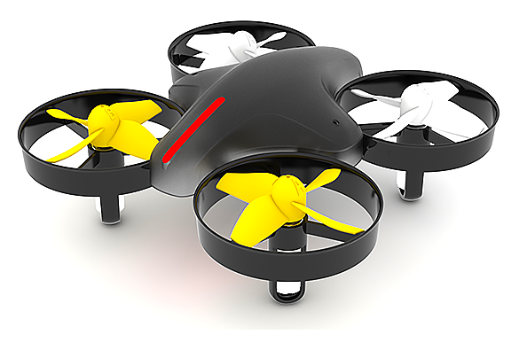

> 드론도 배우고, 코딩도 배울수 있는 스마트한 코딩드론, 코드론 미니!

8세부터 전문가까지 모두가 즐길수 있는 고성능 드론입니다. 여러분의 아이디어를 쉽게 블록 타입으로 코딩하고, 키보드 버튼만 클릭하면?자동으로 드론이 생각한대로 비행하게 됩니다. 코드론 미니는 기존 코드론 시리즈 보다 쉽고 안전하게 사용자가 드론에 대한 완벽한  이해와 놀이를 통해서 드론 전문가와 코딩 전문가가 될 수 있도록 개발한 제품입니다.   교재로 어렵게 코딩을 시작하지 않아도, 부담스러운 가격대의 드론으로 시작하지 않아도  코드론 미니와 함께라면 코딩과 드론, 두 가지를 한 번에 시작하실 수 있어요! 

코딩 입문자들을 위한 스크래치형태의 블럭 방식 프로그램부터 파이썬까지 다양한 오픈소스 소프트웨어로 코딩을 할 수 있습니다.

# 기능

코드론 미니는 드론이 갖추어야할 기본적인 모든 것을 가지고있습니다.

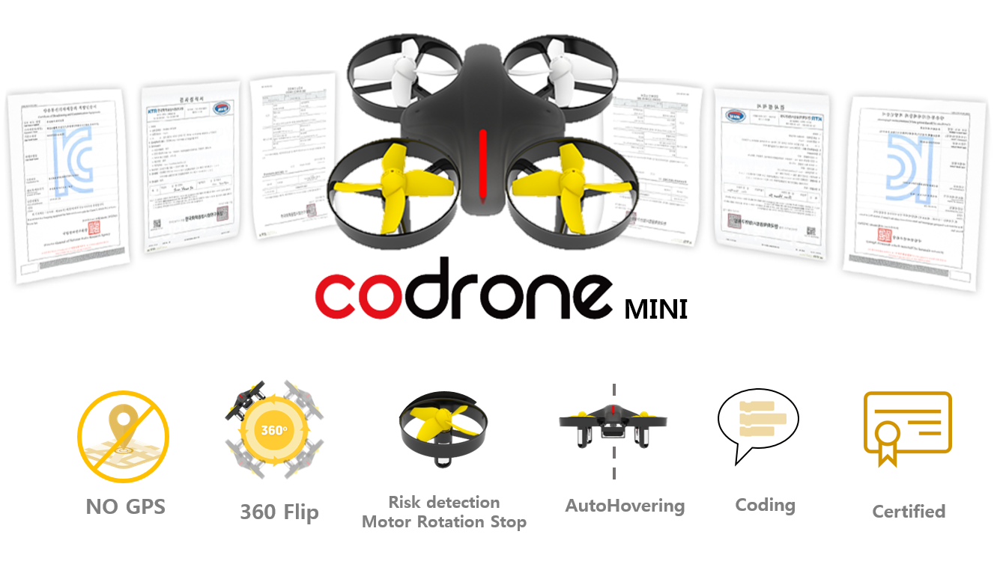

드론과 리모콘을 통해 다양한 컨트롤과 유지보수까지 가능합니다.

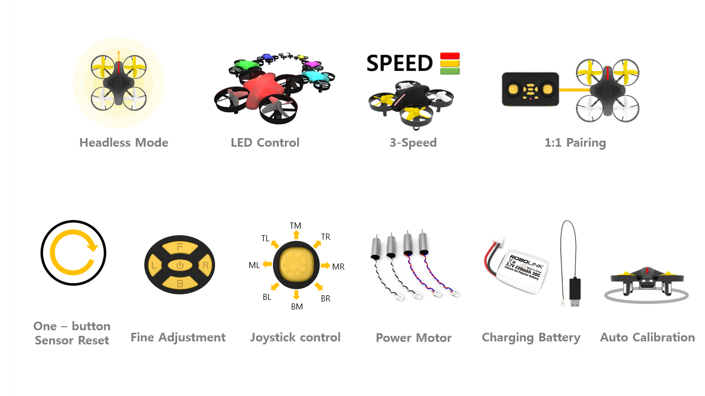
  

# 스펙

## 실제구성
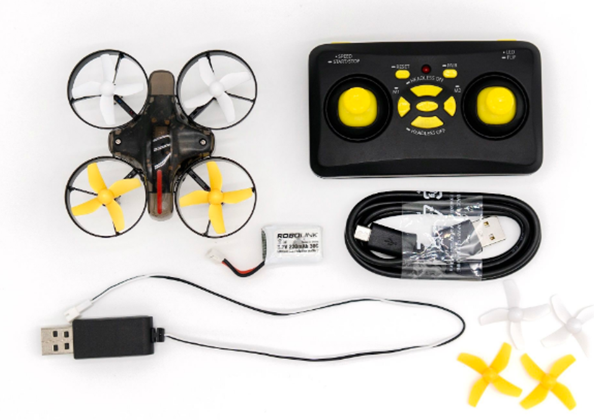

# 활용

코드론 미니는 리모콘 조종/가상조종/ PC모니터링 제어/ 블록프로그램 총 4 가지로 즐길 수 있습니다.

## 리모콘 조종

조이스틱을 이용한 드론 비행으로 언제어디서든 조종이 가능합니다.

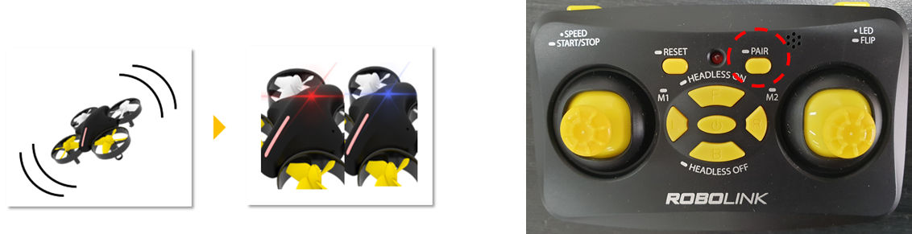

* **Pairing** :  처음에 한번 드론과 조종기를 연결하는 절차입니다. 드론에 전원을 넣어주고 20초안에 흔들어줍니다. 그럼 드론의 LED가 파란색과 빨간색으로 점멸합니다.이 상태에서 리모콘의 Pairing버튼을 몇초간 눌러줍니다. 연결이 되면 드론의 LED가 멈추고 리모콘의 비프음이 울립니다

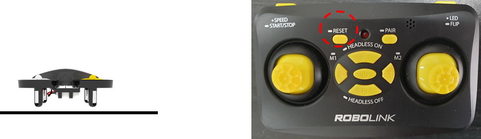

* **Reset**  : 드론을 평평한곳에 두고 캘리브레이션을 하는 절차입니다. 드론을 바닥에 두고 리모콘의 RESET 버튼을 한번 눌러줍니다.그럼 드론의 LED가 반응하고 다시 멈추게됩니다 

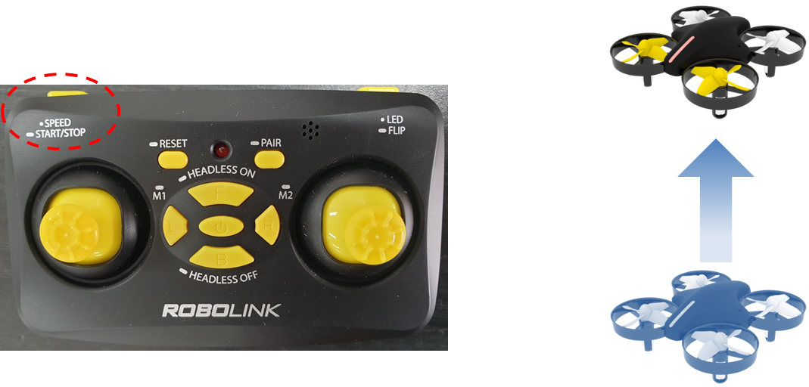

* **Start** : 약 4초간 오른쪽 측면에 있는 버튼을 누르면 자동으로 드론이 이륙하여 호버링합니다

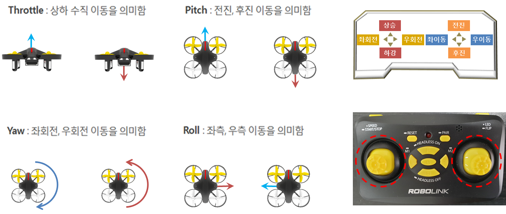

* **Flying** : 왼쪽 조이스틱을 이용하여 상승/하강/좌회전/우회전를 , 오른쪽 조이스틱을  이용 하여 전진/후진/좌이동/우이동을 합니다.

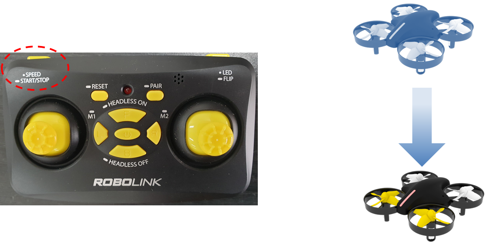

* **Stop** : 원하는 목표지역에 착륙하기 위하여 약 4초간 오른쪽 측면에 있는 버튼을 누르면 천천히 내려와 착륙합니다.

> [드론 조종법 및 퀵매뉴얼 PDF 다운로드 받기](https://github.com/EBWon/robolink/blob/master/codronemini/pdf/remotecontroller.pdf)

## 드론시뮬레이터 가상 비행

조이스틱을 이용한 가상 드론 비행으로 드론을 실제 날리지 않아도 모니터상의 드론을 다양한 방법으로 조종하고 연습할 수 있습니다.

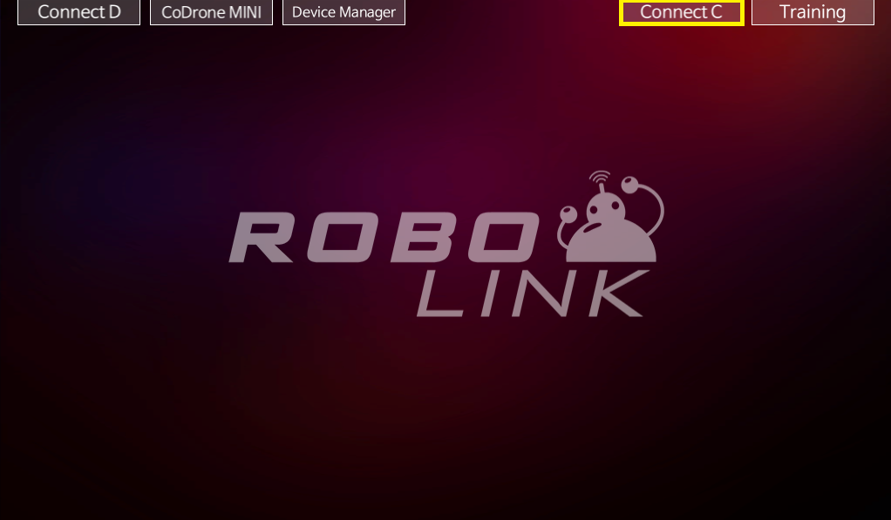
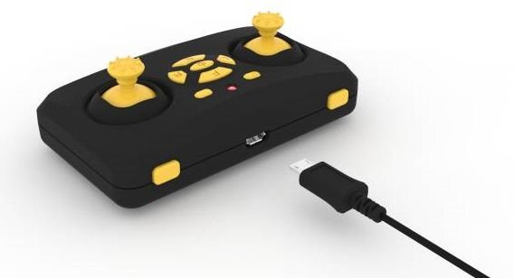

* **Connection** : PC와 리모콘을 USB케이블로 연결하고 드론시뮬레이터를 실행하고 우측상단의 ConnectC 버튼에서 포트를 연결하고 Training버튼을 눌러 가상 드론 조종화면으로 넘어갑니다.

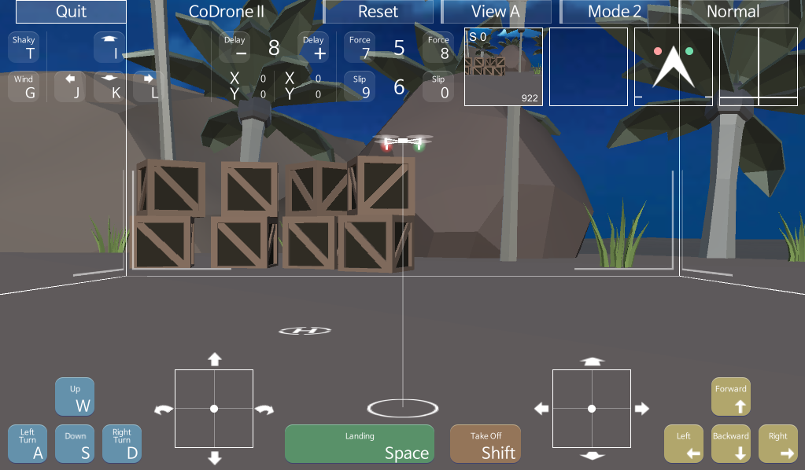

* **Virtual Flight** : 실제 드론을 조종하는것처럼 유선으로 연결된 리모콘을 통해 화면의 드론을 제어해보세요.

> [드론 시뮬레이터 PDF 매뉴얼 다운로드 받기](https://github.com/EBWon/robolink/blob/master/codronemini/pdf/simulator.pdf)

## 드론시뮬레이터 모니터링 비행

PC를 통해서 드론의 다양한 센서값 및 드론상태를 모니터링하고 실제 키보드를 이용하여 드론을 제어하고 자율 비행까지도 손쉽게 해볼수 있습니다.

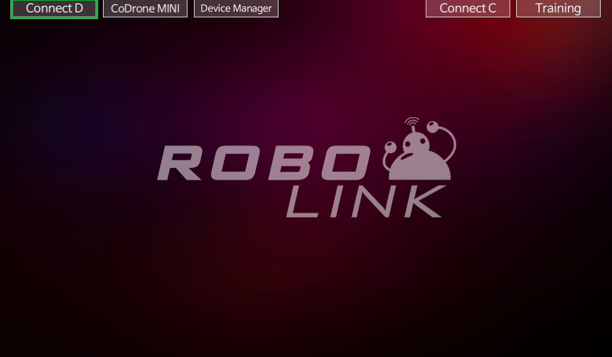

* **Connection** : PC와 리모콘을 USB케이블로 연결하고 드론시뮬레이터를 실행하고 우측상단의 ConnectionD 버튼에서 포트를 연결하면 드론 모니터링 화면으로 넘어갑니다.

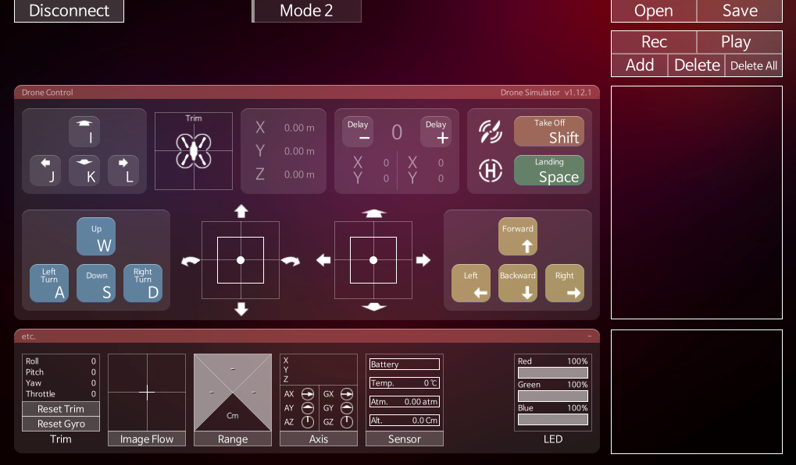

* **Play** : 드론의 상태값을 모니터링해보고 실제 키보드로 드론을 비행해보고, 순차비행프로그램 툴을 통해 자율 비행도 해볼 수 있습니다.

## 로킷 브릭

마우스를 활용한 드래그&드랍 블록형 코딩 프로그래밍을 이용하여 다양한  드론 제어와 실험, 게임, 미션등을 무궁무진하게 해볼 수 있습니다.

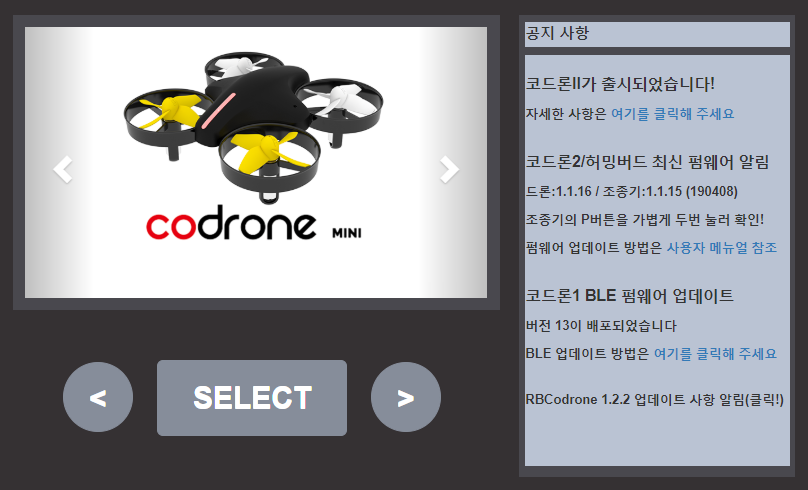

* **Selection** : PC와 리모콘을 USB케이블로 연결하고 RokitBrick을 실행하고 드론종류에서 코드론 미니를 선택하고 SELECT 버튼을 누릅니다.

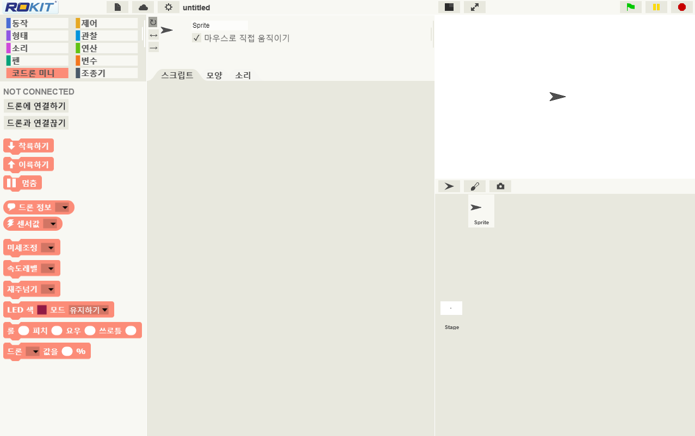

* **Connection & Play** : 좌측 상단의 블록군에서 “코드론 미니”탭을 누르고 바로 밑에 드론에 연결하기를 눌러서 포트를 연결하고 원하는 블록을  중앙 스크립트에 이동하여 다양한 드론 제어를 실시간으로 할 수 있습니다. 

> [로킷 브릭 PDF 매뉴얼 다운로드 받기](https://github.com/EBWon/robolink/blob/master/codronemini/pdf/rokit.pdf)